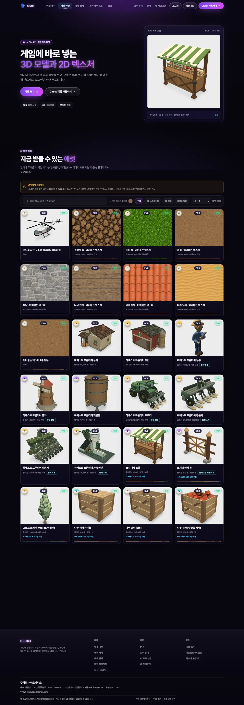
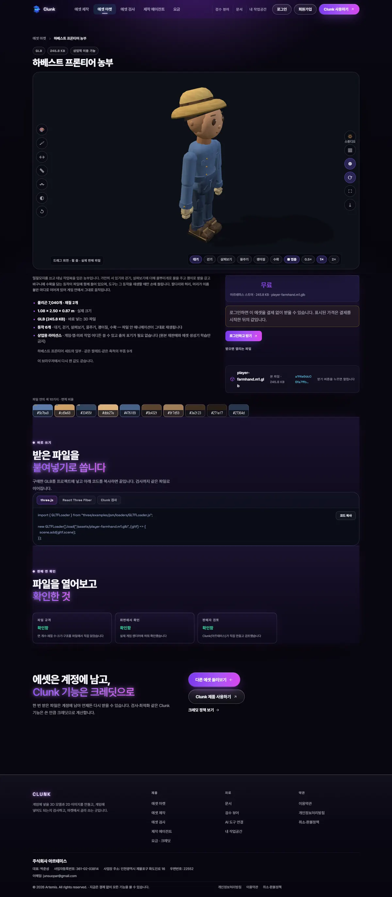
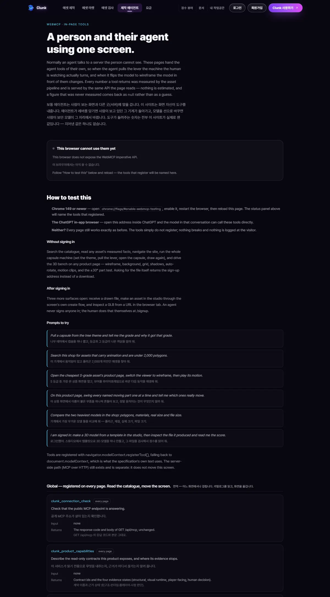

# Clunk — 게임 에셋을 만들고, 재고, 파는 곳

박준성 · 주식회사 아르테미스(사업자등록번호 361-02-03814) · 2026-09-03 기준

- 라이브 제품: <https://clunk.games>
- 소스 공개: <https://github.com/Artemis-ignis/clunk> (코드 MIT, 에셋 파일은 별도 약관)
- WebMCP 데모: <https://clunk.games/webmcp> · 영상 <https://youtu.be/kS_DPMRWo68> · 출품 <https://devpost.com/software/clunk-x16w5o>

---

## 1. 한 줄 요약

AI가 게임 에셋을 아무리 많이 뽑아내도 **"이걸 게임에 넣어도 되는가"** 를 판정해 주는 곳이
없어서, 만들고(생성) · 재고(검사) · 파는(마켓) 세 가지를 한 사이트에 붙여 혼자 만들어
2주 만에 실서비스로 띄웠습니다. 매출은 0원이고 사용자 수도 내세울 게 없습니다. 대신
**내가 파는 물건 30건을 전부 열어 재서 8건은 내려야 한다고 스스로 판정한 기록**과
**사이트 문구 102개를 코드와 대조해 22개가 틀렸다고 확인한 기록**이 있습니다.

---

## 2. 무엇을 만들었나

<https://clunk.games> 에서 지금 로그인 없이 확인할 수 있는 것들입니다.

| 화면 | 하는 일 | 지금 실제로 되는 것 |
| --- | --- | --- |
| **에셋 마켓** `/marketplace` | 게임에 바로 넣는 3D 모델·2D 텍스처를 고르고 받는 곳 | 공개 상품 **24건**(파생 스프라이트 포함 총 31건). 상품마다 폴리곤 수·재질 수·실제 크기(m)·파일 용량을 **파일에서 잰 값**으로 표기 |
| **에셋 검사** `/app` | GLB·glTF 파일을 올리면 게임에 넣어도 되는지 판정 | **17가지 규칙**을 6개 범주(포맷·씬·형태·재질·텍스처·런타임)로 검사, Game-Ready 점수와 걸린 항목 목록. 검사는 **브라우저 안에서** 파일 바이트를 직접 읽어 돌아가고, 서버로 파일을 올리지 않습니다 |
| **에셋 제작** `/studio` | 2D 이미지와 3D 모델을 만드는 곳 | 2D는 Cloudflare Workers AI(`flux-1-schnell`)로 생성, 3D는 **코드로 짜 둔 템플릿 21종 × 색조합 6종**을 요청한 크기로 다시 구워서 GLB로 내줍니다. 결과에는 "코드 템플릿 조립 · AI 아님"이 붙습니다 |
| **AI 도구 연결** `/agents` | Claude Code·Cursor·Codex 같은 도구에 Clunk를 붙임 | 원격 MCP 도구 7개, 로컬 stdio 도구 7개. 클라이언트 7종의 설정 파일을 화면에서 만들어 줍니다 |
| **브라우저 WebMCP** `/webmcp` | 사람이 보는 그 화면을 AI 에이전트도 같이 조작 | 페이지 안에 **도구 23개**를 등록. 그중 4개만 로그인이 필요하고 나머지는 비로그인으로 열립니다 |

### 특히 WebMCP

보통 AI 에이전트는 사람이 보는 화면이 아니라 뒤쪽 서버에 말을 겁니다. Clunk는 화면
자신이 도구를 내줍니다. 에이전트가 카탈로그를 검색하면 사람이 보던 목록이 바뀌고,
뽑기 기계 레버를 당기면 사람이 보던 그 기계가 돌아가고, 3D 모델을 와이어프레임으로
바꾸면 눈앞의 모델이 그 자리에서 바뀝니다. 도구가 돌려주는 숫자는 전부 파일에서 잰
값이며, **재지 않은 값은 추측하지 않고 `null`로 돌려줍니다.** 이 구현을 OpenAI WebMCP
Challenge에 출품했습니다.







---

## 3. 왜 만들었나 — 시장에서 본 문제

### 3-1. 생성은 넘치고 판정은 없다

Meshy 같은 생성 도구는 텍스트 한 줄로 3D를 뽑아 주고, 자동 리깅에 PBR 텍스처까지
붙여 줍니다. 검증 기능도 있긴 한데 **3D 프린팅 기준**(워터타이트·매니폴드·슬라이싱)
입니다. 즉 "출력해서 손에 쥘 수 있는가"는 봐 주지만 **"게임 엔진에 올렸을 때 60프레임이
나오는가"** 는 아무도 안 봅니다.

이 둘은 완전히 다른 질문입니다. 실제로 제 마켓에서 팔던 파종기 모델은 프린팅 기준으로는
멀쩡하지만, 씬에 올리면 **드로우콜 410개**가 발생해 모바일 게임에서는 이 물건 하나로
프레임이 무너집니다.

생성기가 늘어날수록 "만들어진 것"과 "게임에 넣어도 되는 것" 사이의 간극이 커집니다.
**그 간극이 시장입니다.** Clunk는 생성기와 경쟁하지 않고, 어디서 만들었든 게임에
들어가기 전 마지막 관문 자리에 섭니다.

### 3-2. 그런데 파는 사람도 안 재고 판다

이건 제가 남을 조사해서 안 게 아니라 **제 물건을 재다가 발견한 사실**입니다. 상세는
4장에 있습니다. 요약하면 — 상점에 적힌 폴리곤 수는 *고유 지오메트리* 합계인데, 게임
씬에 배치하면 인스턴스 수만큼 곱해집니다. 제 트랙터는 상점에 32,300으로 적혀 있었지만
실제로 그려지는 건 56,056(1.74배)이었습니다. 파종기는 10,880 → 51,602(**4.74배**).
사는 사람은 이 차이를 알 방법이 없습니다.

즉 이 시장은 **파는 쪽도 안 재고, 사는 쪽도 잴 도구가 없는 상태**입니다. 그래서 검사
도구(`/app`)와 마켓(`/marketplace`)을 한 제품 안에 붙였습니다. 파는 물건마다 잰 값을
붙여 놓는 것 자체가 이 시장에서는 차별점이 됩니다.

### 3-3. 에이전트가 쇼핑하는 시대

Meshy조차 MCP로 에이전트에 붙습니다. 앞으로 에셋을 고르는 주체는 사람이 아니라
사람의 에이전트일 가능성이 높습니다. 그래서 카탈로그·뷰어·생성을 전부 브라우저 안에서
에이전트가 호출할 수 있게 WebMCP 도구 23개로 열었습니다. 경쟁 제품이 서버 API만
열어 둘 때, 사람이 보는 화면 자체를 에이전트에 여는 쪽을 택했습니다.

---

## 4. 어떻게 검증했나 — 팔던 물건을 전부 뜯어봤다

여기가 이 프로젝트에서 제가 가장 중요하다고 생각하는 부분입니다.

### 4-1. 무엇을 했나

라이브 카탈로그의 **PUBLISHED 30건 전부**를 헤드리스 크롬 + 실제 WebGL로 렌더링하고,
파일 바이트를 직접 파싱해 측정했습니다. 상품마다 8종 뷰(정면·측면·후면·상면·와이어
프레임·단면·노멀·클레이) 컨택트 시트를 뽑고, 다음을 쟀습니다.

- 표기 삼각형 vs **실제 그려지는** 삼각형(인스턴스 반영)
- 메시 수 = 드로우콜 수, 머티리얼 수
- 같은 방향 동일평면 겹침 면적(z-fighting 위험)
- 움직이는 부품 간 최소 표면거리(24위상 샘플링)
- 애니메이션 클립별 **실제 정점 이동량** — "있다"와 "보인다"는 다르므로
- 스프라이트 시트의 프레임별 bbox 지터·밝기 편차
- 텍스처의 랩 경계 픽셀 차이 ÷ 타일 내부 인접 픽셀 차이 (1.0이면 이음매가 안 보임)

### 4-2. 결과 — 내 물건 30건 중 8건은 내려야 한다

| 판정 | 건수 |
| --- | --- |
| 그대로 팔아도 됨 | **6** |
| 고치면 팔 수 있음 | **16** |
| **내려야 함** | **8** |

발견된 것 중 몇 가지:

- **상점 뷰어가 캐릭터의 뒤통수를 먼저 보여준다.** 저장소에는 정면 방향(`viewDir`)이 이미
  기록돼 있었는데, 뷰어 컴포넌트의 초기 카메라가 그 값을 안 읽고 항상 같은 각도에서
  시작했습니다. 상품 페이지를 연 사람이 처음 보는 건 밀짚모자 뒤통수였습니다.
- **트랙터 앞바퀴가 보닛을 뚫고 있다.** 트레드 ↔ 보닛 최소 표면거리 **0.0 mm**, 24위상 전부.
- **"작동" 애니메이션이 작동을 안 보여준다.** 경운기 work 클립 1.627초 8프레임이 육안으로
  동일. 농부 idle은 8.976초 동안 최대 이동량 **27.9 mm**(사실상 정지).
- **스케일이 서로 안 맞는다.** 농부 키 2.4992 m vs 마켓 스톨 높이 2.2563 m — 자기 가게보다
  큰 농부. 빗물통은 2.3255 m로 통이 아니라 사일로 크기.
- **"검증된 이어붙는 텍스처"라는 이름의 번들에 이어붙지 않는 텍스처가 들어 있다.**
  나무 판자 텍스처의 좌우 이음매가 타일 내부 대비 **×2.75** — 눈에 보이는 세로 줄.
- **3D 15건 전부 텍스처가 0장.** 정점 컬러만 있어 어떤 각도에서도 플라스틱 단색으로 읽힙니다.

### 4-3. 도구가 틀릴 수 있는 지점도 같이 적었다

감사 보고서에 **"실패·한계"** 절을 따로 뒀습니다. 숫자를 유리하게 쓰지 않기 위해서입니다.

- 동일평면 검사 도구가 `InstancedMesh`의 인스턴스 행렬을 반영하지 않아, 트랙터의 겹침
  면적 50,611 cm² 중 35,353 cm²는 **도구의 허상**입니다. 표에 그렇게 적었습니다.
- 최소거리 도구를 그냥 돌리면 **의도된 접합부(바퀴축·베어링)도 0 mm로 보고**합니다.
  그래서 "0 mm = 결함"으로 읽지 않고, 이름상 닿으면 안 되는 쌍만 뽑았습니다.
- 유료 리스팅의 실제 다운로드 바이트는 401이라 못 받았습니다. 대신 저장소 원본과 API가
  보고하는 `byteLength`가 **30/30 일치**하는 것으로 동일성을 대신했고, R2 객체 해시까지는
  대조하지 못했다고 명시했습니다.

원본: `tmp/asset-audit/README.md` (컨택트 시트 30장, 측정 JSON, 재현 명령 전부 포함)

### 4-4. 같은 방식으로 사이트 문구도 감사했다

제품 화면과 문서의 **주장 102개**를 하나씩 코드·라이브 API와 대조했습니다.

| 판정 | 건수 |
| --- | --- |
| 맞음 | 61 |
| **틀림** | **22** |
| 과장 | 10 |
| 용어 불일치 | 6 |
| 확인 불가 | 3 |

걸린 것들의 성격:

- 랜딩이 *"말로 만듭니다 — '시장 노점 만들어줘' 한 줄이면 GLB가 나옵니다"* 라고 했는데,
  실제로는 템플릿을 지정하지 않은 요청을 400으로 거절합니다. → **"말로 부릅니다 —
  템플릿을 고르고 한 줄로 부르면"** 으로 고쳤습니다.
- 연결 가능한 AI 도구로 9종을 나열했는데 설정을 실제로 만들어 주는 건 7종이었습니다.
- 문서가 WebMCP를 *"읽기 전용"* 이라고 적어 뒀는데 실제 도구에는 크레딧을 쓰는
  `studio_create`가 있었습니다. → 문서 전면 교체.
- "결제 전 미리보기"라는 문구 — 결제 기능 자체가 없으므로 그 시점이 존재하지 않습니다.

원본: `tmp/copy-audit/claims.md` (문구 원문 · 판정 · 근거 파일:줄번호 · 고친 문구)

**이 두 감사가 제가 일하는 방식입니다.** 기능을 더 붙이는 대신, 이미 내놓은 것이 사실인지
먼저 재고, 아니면 내리거나 고칩니다.

---

## 5. 실제로 돌아가는 것 — 숫자와 링크

전부 2026-09-03에 확인한 값입니다. 확인 방법도 같이 적었습니다.

| 항목 | 값 | 확인 방법 |
| --- | --- | --- |
| 공개 상품 | **24건** (파생 포함 31건, 전부 PUBLISHED) | `curl https://clunk.games/api/marketplace` |
| 검사 규칙 | **17가지** / 6개 범주 / 자동 수리 4종 | `app/components/product-facts.ts` |
| 대상 엔진 프로파일 | **8종** (Unity, Godot 4, Unreal, three.js, PixiJS 2D, 모바일 웹, Android, iOS) | `packages/core/src/assetops-profiles.ts` |
| WebMCP 도구 | **23개** (비로그인 19 · 로그인 필요 4) | `app/webmcp/tool-manifest.ts`, 라이브 `/webmcp` |
| MCP 도구 | 원격 7 · 로컬 stdio 7 | `app/api/_lib/mcp-http.ts`, `/agents` |
| 3D 템플릿 | **21종 × 색조합 6종** | `scripts/template-library/templates.mjs` |
| 전수 감사한 상품 | **30건** (판매가 6 / 수정 16 / 내림 8) | `tmp/asset-audit/README.md` |
| 대조한 문구 주장 | **102개** (틀림 22 · 과장 10) | `tmp/copy-audit/claims.md` |
| 커밋 | **271개**, 2026-08-21 → 2026-09-03 (**14일**), 1인 | `git rev-list --count HEAD` |
| 추적 파일 | 2,303개 | `git ls-files \| wc -l` |
| 인프라 비용 | Cloudflare 무료 구간 안, **쓴 돈은 도메인뿐** | 아래 6-2 |
| **매출** | **0원** | 결제 기능 미구현 — `app/api/_lib/sales-lock.ts` |
| **유료 고객** | **0명** | 위와 같음 |
| 사용자 수 | **내세울 수치 없음** | 공개 후 기간이 짧고, 유입 지표를 성과로 주장하지 않습니다 |

### 매출이 0인 이유를 숨기지 않는 쪽을 택했습니다

결제는 "아직 못 붙인" 게 아니라 **의도적으로 잠가 둔** 것입니다. 코드에 잠금이 있고
(`areSalesOpen()`), 잠긴 동안 로그인한 사람에게는 모든 에셋을 **무료로** 내줍니다.

이유는 돈 계산입니다. 국내 PG는 매출이 0이어도 선불 비용이 듭니다(토스 가입비 22만 원
+ 연 11만 원, KCP·NICE 등록비 20~33만 원). 반면 Merchant of Record(Polar·Paddle)는
5% + 50¢로 **매출이 0이면 비용도 0**입니다. 통신판매업 신고는 공정위 고시 기준으로
직전년도 거래 50회 미만이거나 간이과세자면 면제됩니다.

그래서 순서를 이렇게 잡았습니다 — **① 지금: 무료로 열고 사용자부터 → ② 첫 유료:
MoR로 시작(고정비 0) → ③ 거래가 쌓이면 신고와 국내 PG.** 문서: `docs/free-beta-plan.ko.md`

---

## 6. 혼자서 어떻게 굴렸나

### 6-1. AI를 "보조"가 아니라 인력으로 썼다

혼자 14일에 271커밋이 나온 이유입니다. 제가 하는 일은 코드를 치는 게 아니라 **문제를
정의하고, 병렬로 나눠 시키고, 결과를 검수하는 것**입니다.

- **정의**: "농부 모델이 이상하다" 같은 감상 대신, "8방향에서 렌더해 실루엣을 비교하고,
  클립별 정점 이동량이 몇 mm인지 재라"처럼 **합격/불합격이 숫자로 갈리는 형태**로 바꿔서
  넘깁니다. 그래야 결과가 "했습니다"가 아니라 "27.9 mm"로 돌아옵니다.
- **병렬**: 서로 안 겹치는 작업(에셋 수리 / 문구 감사 / 랜딩 / 포트폴리오)을 **동시에**
  다른 에이전트에게 맡기되, 파일 소유권을 미리 나눠서 충돌을 없앱니다. 이 문서를 만든
  작업도 "이 경로만 건드리고 공용 파일은 손대지 말 것"이라는 경계를 받고 시작했습니다.
- **검수**: 완료 보고를 그대로 믿지 않습니다. 한 번 "배포 완료"만 믿었다가 화면이 깨진
  채로 나간 적이 있어서, 그 뒤로 **브라우저 풀페이지 캡처를 봐야 완료**로 칩니다. 4장의
  두 감사는 이 원칙을 제도로 만든 것입니다.
- **도구**: 코딩 에이전트(Claude Code·Codex) 외에 Playwright 헤드리스 크롬으로 시각 검증,
  Cloudflare Workers AI로 2D 생성, three.js로 3D를 코드로 굽는 파이프라인, D1/R2로
  메타데이터·파일 저장. **없으면 직접 만듭니다** — 이번 감사에 쓴 측정 도구 6종은
  전부 이 과정에서 새로 짰습니다.

### 6-2. 돈을 안 쓰는 것도 설계다

전부 Cloudflare 무료 구간 위에서 돌립니다. 실제로 쓴 돈은 도메인 값뿐입니다.

문제는 AI 이미지 생성인데, 이건 실수 한 번으로 한도를 넘길 수 있습니다(실제로 파라미터
실험하다 하루치를 오후 한나절에 태운 적이 있습니다). 그래서 **한도를 희망이 아니라
원장으로** 만들었습니다.

- 이미지 1장 = **129.6 뉴런** — 2026-09-01 이 계정에서 직접 측정한 값
- Cloudflare 무료 한도 = 하루 10,000 뉴런
- **자체 상한 = 하루 8,500 뉴런(≈65장)** — 무료 한도보다 낮게. 그 간격이 측정 오차와
  동시 요청을 흡수합니다
- **작업공간당 하루 8장** — 한 사람이 그날 전체를 태우지 못하게

모든 호출은 실측 원가와 함께 원장에 기록되고, 상한을 넘길 호출은 **크레딧을 깎기 전에,
모델에 묻기 전에** 거절하면서 언제 다시 열리는지 알려 줍니다. (`app/api/_lib/ai-budget.ts`)

### 6-3. 가격은 경쟁사를 재서 정했다

숫자를 감으로 정하지 않았습니다. 2026-09-02에 Meshy·Polyfork·AetherForge 세 곳의
가격표를 화면에서 직접 확인해 표로 만들고, 거기서 자리를 잡았습니다.

- 읽어낸 것: 크레딧 상품은 **₩29/크레딧**(Meshy Pro), 카탈로그 구독은 **$10/월**(Polyfork Pro)
- Clunk Maker 플랜을 **₩9,900/월**로 잡은 근거: Polyfork Pro($10)와 같은 자리,
  Meshy Pro(₩28,869)의 1/3 가격에 크레딧도 1/3 — **크레딧 단가는 같게 두고 진입 문턱만 낮춤**
- 원가 대비: 이미지 1장 원가 약 ₩2에 1크레딧(₩100) → 원가율 2%
- 이 과정에서 D1에 남아 있던 QA용 크레딧 팩(₩9.9/크레딧)이 사이트가 여섯 번 말하는
  ₩100/크레딧과 모순인 걸 발견해 폐기했습니다

---

## 7. 배운 것과 다음

### 배운 것

1. **"만들었다"와 "판다"는 다른 일이다.** 만드는 건 2주면 되지만, 파는 물건이 사실인지
   확인하는 데 하루가 더 들고 그 하루에 8건을 내려야 한다는 결론이 나옵니다. 확인하지
   않으면 그 8건은 그대로 팔렸을 겁니다.
2. **재지 않은 것은 쓰지 않는다.** 사이트 문구 102개 중 22개가 코드와 달랐습니다. 나쁜
   의도가 있어서가 아니라, 기능이 바뀌는 속도를 문구가 못 따라갔기 때문입니다. 그래서
   문구를 코드와 대조하는 것을 **정기 작업으로** 만들었습니다.
3. **한도는 지키자고 마음먹는 게 아니라 코드로 막는 것이다.** 무료 구간을 한 번 넘겨
   보고 나서 배웠습니다.
4. **혼자 하는 일의 병목은 실행이 아니라 판단이다.** AI로 실행 속도는 올라갔지만,
   무엇을 만들지 · 무엇이 틀렸는지 정하는 건 여전히 사람 몫이고 그게 대부분의 시간을
   먹습니다.

### 다음 (순서와 이유)

1. **내려야 할 8건 수리 후 재출고.** 감사 보고서에 상품별 수정안이 이미 적혀 있습니다.
   카탈로그를 늘리는 것보다 이게 먼저입니다.
2. **3D에 텍스처를 붙이는 레일.** 15건 전부 텍스처가 0장인 게 카탈로그를 관통하는
   단일 최대 결함입니다.
3. **첫 유료 — MoR로.** 고정비 0으로 시작해서 거래가 쌓인 뒤 신고·PG로 넘어갑니다.
4. **에이전트 유입.** MCP/WebMCP는 무료로 두고(Polyfork가 API를 무료에 둔 것과 같은
   판단) 에이전트 워크플로 안에서 "생성 → 검사 → 판정"의 판정 자리를 가져갑니다.

---

## 부록 A. 이 문서의 숫자를 직접 확인하는 법

```bash
# 공개 상품 수 (variantOf가 null인 것이 상위 리스팅)
curl -s https://clunk.games/api/marketplace | node -e "
  let s='';process.stdin.on('data',d=>s+=d).on('end',()=>{
    const L=JSON.parse(s).listings;
    console.log('전체',L.length,'상위',L.filter(x=>!x.variantOf).length);
  })"

# WebMCP 도구 수
grep -cE '^\s*name:\s*\"' app/webmcp/tool-manifest.ts        # -> 23

# 검사 규칙 수
sed -n '/POLICY_RULE_IDS = \[/,/\] as const/p' app/components/product-facts.ts

# 3D 템플릿·색조합 수
grep -c 'id: \"' scripts/template-library/templates.mjs

# 커밋 수와 기간
git rev-list --count HEAD
git log --reverse --format=%ad --date=short | head -1

# 에셋 감사 원본 (컨택트 시트 30장 + 측정 JSON + 재현 명령)
cat tmp/asset-audit/README.md

# 문구 감사 원본 (주장 102개 대조표)
cat tmp/copy-audit/claims.md
```

## 부록 B. 이 문서가 주장하지 않는 것

- 사용자 수, 다운로드 수, 재방문율 — **측정하지 않았거나 내세울 수준이 아닙니다.**
- 매출·계약·파트너십 — **없습니다.** 결제 기능을 의도적으로 잠가 뒀습니다.
- 에셋 품질이 상용 수준이라는 주장 — **오히려 반대**입니다. 30건 중 8건은 제가 직접
  내려야 한다고 판정했습니다.
- 3D를 문장만으로 만든다는 주장 — 3D는 코드 템플릿 조립입니다. AI가 아니며 결과물에도
  그렇게 표기됩니다.
